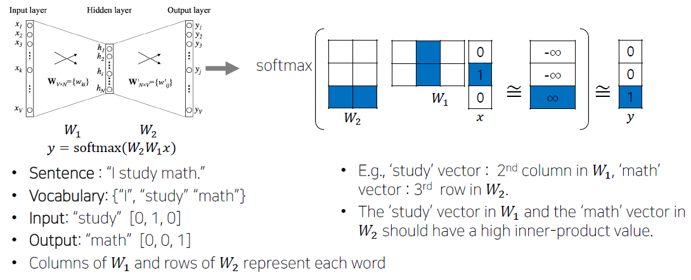

# Day 16

## 학습 내용
  - [x] NLP
    - [x] Bag-of-Words
    - [x] Word Embedding

  

## 개인 학습
---
### Bag-of-Words Representation
나타내고자 하는 문장들을 단어 단위로 tokenization시켜 단어의 뭉치(bag-of-words)를 만듭니다. 
> 예시
> Example sentences: "John really really loves this movie", "Jane really likes this song"
> Vocabulary: {"John", "really", "loves", "this", "movie", "Jane", "likes", "song"}

위 예시처럼 만들어진 카테고리형 variable인 vocabulary를 one-hot vector로 인코딩하여 표현합니다. 이를 위해 단어의 개수 만큼의 차원을 가진 벡터를 설정하여 나타낼 수 있습니다. 
> 예시
> John : [1 0 0 0 0 0 0 0]
> really : [0 1 0 0 0 0 0 0]
> loves : [0 0 1 0 0 0 0 0]
> ...

이를 통해 각각의 벡터 간의 유클리드 거리가 $\sqrt2$로 일정하며, 유사도인 내적값 cosine similarity가 0임을 알 수 있습니다. 즉 각각의 단어가 동일한 관계를 가지도록 표현된 것입니다.   

이를 활용하여 앞서 보았던 예시 문장을 벡터로 표현하면 다음과 같습니다.
> 각 단어의 one-hot 벡터를 더하여 표현
> "John really really loves this movie" [1 2 1 1 1 0 0 0]
> "Jane really likes this song" [0 1 0 1 0 1 1 1]

 

### Bag-of-Words for Document Classification: NaiveBayes Classifier
Bag-of-words로 표현된 document를 정해진 카테고리나 분류로 classification하는 방법 중 하나인 NaiveBayes Classifier에 대해 알아보도록 하겠습니다.   

이름에서 알 수 있듯이 Bayes' Rule을 사용하여 class에 속할 확률을 계산합니다. 
> For a document $d$ and a class $c$
> $c_{MAP} = argmax_{c \in C} P(c|d)$  &nbsp;&nbsp;&nbsp;&nbsp;&nbsp;&nbsp;&nbsp;&nbsp;&nbsp;&nbsp;&nbsp;&nbsp; #특정 document인 d가 주어졌을 때 특정 클래스 c에 속할 확률
> by Bayes' Rule $argmax_{c \in C} \frac{P(d|c)P(c)}{P(d)}$ #$P(d)$는 주어진 document로 상수값을 가지므로 생략 가능
> Thus, $c_{MAP} = argmax_{c \in C} P(d|c)P(c)$      
> 
> 여기서 $P(d|c)$는 특정 클래스 c가 주어졌을 때 d가 c에 속할 확률로, d는 sequence of words이므로 word w로 나타낼 수 있습니다. 
> $P(d|c) = P(w_1,w_2,...,w_n|c) = \prod_{w_i \in W} P(w_i|c)$로 나타낼 수 있고, 위 식은 다음과 같이 정리됩니다.
> $c_{MAP} = argmax_{c \in C} P(c)\prod_{w_i \in W} P(w_i|c)$  

예시 분류 문제
> Training set
> 1) Image recognition uses convolutional neural networks / class: CV
> 2) Transformer can be used for image classification task / class: CV
> 3) Language modeling uses transformer / class: NLP
> 4) Document classification task is language task / class: NLP
> 
> Test
> Classification task uses transformer / class: ?

우리는 앞서 구한 $c_{MAP} = argmax_{c \in C} P(c)\prod_{w_i \in W} P(w_i|c)$로부터 max값을 가지는 class로 유추가 가능하다는 것을 알고 있습니다. 각각의 확률을 계산하여 max값을 찾아보도록 하겠습니다.   

먼저 Class는 CV와 NLP 두개로 총 4개의 train data에서 각각 두개씩 존재합니다. 이를 통해   
$P(c_{CV}) = P(c_{NLP}) = \frac{2}{4} = \frac{1}{2}$임을 알 수 있습니다.   
더불어 test에 활용되는 문장을 bag-of-words로 나타내면 {Classification, task, uses, transformer} 4개의 단어로 이루어져 있음을 알 수 있고, 앞서 $P(d|c) = \prod_{w_i \in W} P(w_i|c)$로부터 각각의 단어가 각 class에 있을 확률을 구하여 곱하게 됩니다.    
> class가 CV인 문장에서 단어의 수는 총 14개
> {Classification, task, uses, transformer} 각각의 단어는 1번씩 존재하므로
> 각각의 확률은 {$P(w_{"classification"}|c_{CV}),P(w_{"task"}|c_{CV}),P(w_{"uses"}|c_{CV}),P(w_{"transformer"}|c_{CV})$}는 $\frac{1}{14}$로 동일함을 알 수 있습니다.
> 
> 같은 방식으로 class가 NLP인 문장에서 단어의 수는 총 10개
> 각각의 단어는 {1, 2, 1, 1}개 존재하므로
> {$P(w_{"classification"}|c_{NLP}),P(w_{"task"}|c_{NLP}),P(w_{"uses"}|c_{NLP}),P(w_{"transformer"}|c_{NLP})$}는
> 각각 {$\frac{1}{10},\frac{2}{10},\frac{1}{10},\frac{1}{10}$}임을 알 수 있습니다.
> 
> 이를 통해 $P(c_{CV}|d_{test}) = P(d_{test}|c_{CV})P(c_{CV}) = P(c_{CV})\prod_{w_i \in d_{test}} P(w_i|c_{CV})$를 계산해보면
> $\frac{1}{2} \times \frac{1}{14} \times \frac{1}{14} \times \frac{1}{14} \times \frac{1}{14}$임을 알 수 있습니다. 
> 같은 방식으로 $P(c_{NLP}|d_{test})$ = $\frac{1}{2} \times \frac{1}{10} \times \frac{2}{10} \times \frac{1}{10} \times \frac{1}{10}$임을 알 수 있습니다. 
> 
> $c_{MAP}$은 argmax 값을 통해 class를 유추하으로 $d_{test}$는 더 큰 값을 가진 $c_{NLP}$에 속한다는 것을 구할 수 있습니다.

 

### Word Embedding
Word Embedding은 단어를 벡터로 표현하여 비슷한 단어의 벡터 간 거리는 가깝게, 연관이 없는 단어의 벡터와는 멀도록 설정하는 것을 의미합니다. 그 기법 중에서도 가장 유명한 **Word2Vec**에 대해 알아보도록 하겠습니다.   

Word2Vec은 같은 문장 내의 인접한 단어끼리 의미가 비슷할 것이라는 가정으로 벡터를 표현합니다. 때문에 한 단어가 그 주변에 있는 단어들을 통해 그 의미를 유추할 수 있다고 판단하여, 주어진 학습 데이터에서 특정 단어 주변에 나타나는 단어들의 확률분포를 예측하게 됩니다.   

위 구조를 바탕으로 예시 문장인 "I study math."를 학습하는 방법에 대해 알아보도록 하겠습니다. 해당 문장을 bag-of-words로 표현하면 vocabulary처럼 나타낼 수 있고 이를 바탕으로 각 단어를 3차원 one-hot 벡터로 나타낼 수 있습니다. word2vec은 인접한 단어의 의미를 유추하기 때문에 이를 학습하기 위해 sliding window 방법으로 train data를 생성합니다.    
Sliding window 방식은 다음과 같습니다. 각각의 한 단어를 중심으로 왼쪽과 오른쪽에 있는 단어들을 각각 한 쌍으로 데이터를 구성하게 됩니다. 
> I study math.
> I를 기준으로 (I, study)
> study를 기준으로 (study, I), (study, math)
> math를 기준으로 (math, study)

이렇게 만들어진 데이터는 위 구조처럼 2개의 layer를 가지는 Neural Net을 지나게 됩니다. hidden layer의 node 개수는 사용자가 정하는 값에 따라 달라지지만, 위 구조에서는 3차원 input, 2차원 hidden layer, 3차원 output으로 구성되어 있습니다.   
위 예시에서는 (study, math) 데이터를 학습하는 것을 보여주고 있습니다. 보이는 것처럼 x는 input인 study, y는 output이자 ground-truth인 math를 나타냅니다. input이 one-hot 벡터이기 떄문에 각 layer의 weight 중 한 행 또는 열의 값에만 영향을 받으며, ground-truth의 값을 출력으로 가질 수 있도록 학습합니다.    

다른 word embedding 기법 중 하나인 **GloVe**에 대해서도 간략히 알아보도록 하겠습니다.   
GloVe와 word2vec의 가장 큰 차이점은 학습 데이터에서 두 단어가 window 내에서 총 몇 번 동시에 등장했는지 미리 계산($P_{ij}$)하여 embedding 벡터($u_i$)와 출력 벡터($v_j$)의 내적 값이 미리 계산된 값에 근사하게 fitting될 수 있도록 loss function을 구성하였습니다.   
> $J(\theta) = \frac{1}{2} \sum_{i,j=1}^W f(P_{ij})(u_i^Tv_j - logP_{ij})^2$

  

## 피어 세션
---
금일 피어 세션에서는 dacon 대회에 각자가 사용하고 있는 모델과 그 성능에 대한 이야기를 나눴습니다. 대회에서 사용하는 MNIST set의 multi-classification 성능을 높히기 위해 GoogLeNet, DenseNet, MobileNet, EfficientNet, RepVGG, RegNet 등 다양한 모델들을 사용하여 각자가 학습한 모델의 성능을 비교하였습니다. 또한, 모델의 변화로 성능 향상을 꾀하기보다, train data augmentation부터 optimizer를 수정하는 방법을 통해 성능을 높히는 방식으로 진행을 하도록 합의하였습니다.
